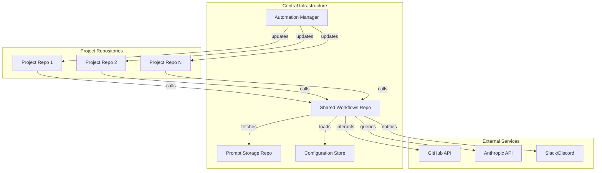
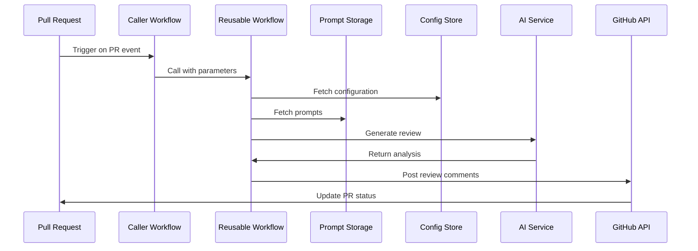

# Product Requirements Document
## Centralized GitHub Workflow Management System

**Version:** 1.0  
**Date:** 2025  
**Status:** Draft  
**Author:** Engineering Team  

---

## 1. Executive Summary

### 1.1 Purpose
This document outlines the requirements for implementing a centralized GitHub workflow management system that eliminates duplicate workflow maintenance across multiple repositories while enabling dynamic configuration and prompt management for AI-powered code reviews.

### 1.2 Problem Statement
Currently, maintaining AI-powered PR review workflows across multiple repositories requires updating each workflow file individually when improvements are made. This creates:
- **Maintenance overhead**: O(n) complexity for updates across n repositories
- **Version inconsistency**: Different repos may run different versions
- **Configuration drift**: Settings diverge over time
- **Slow iteration**: Updates require PRs to every repository

### 1.3 Solution Overview
Implement a centralized workflow system using GitHub's reusable workflows feature, combined with external configuration management and automated propagation mechanisms.

---

## 2. Goals and Objectives

### 2.1 Primary Goals
- **Reduce maintenance overhead by 90%** through centralization
- **Enable instant prompt updates** without workflow modifications
- **Maintain version consistency** across all repositories
- **Support repository-specific customization** without code duplication

### 2.2 Success Metrics
| Metric | Current State | Target | Measurement Method |
|--------|--------------|--------|-------------------|
| Time to update all workflows | 2-4 hours | < 5 minutes | Deployment logs |
| Workflow version consistency | ~60% | > 95% | Automated scanning |
| Mean time to propagate changes | 1-2 days | < 1 hour | CI/CD metrics |
| Repository onboarding time | 30 minutes | < 5 minutes | Setup documentation |
| Prompt update frequency | Weekly | Daily+ | Git commit history |

---

## 3. Functional Requirements

### 3.1 Core Workflow Management

#### 3.1.1 Reusable Workflows
- **REQ-CW-001**: System SHALL provide reusable workflow definitions in a central repository
- **REQ-CW-002**: Workflows SHALL support parameterization for repository-specific configuration
- **REQ-CW-003**: Each repository SHALL require only a minimal caller workflow (<20 lines)
- **REQ-CW-004**: System SHALL support multiple workflow types (PR review, issue response, etc.)

#### 3.1.2 Version Management
- **REQ-VM-001**: Workflows SHALL be versioned using semantic versioning (semver)
- **REQ-VM-002**: Repositories SHALL be able to pin to specific versions or version ranges
- **REQ-VM-003**: System SHALL support rolling updates and rollbacks
- **REQ-VM-004**: Breaking changes SHALL require major version bumps

### 3.2 Configuration Management

#### 3.2.1 Configuration Profiles
- **REQ-CF-001**: System SHALL support named configuration profiles (default, frontend, backend, etc.)
- **REQ-CF-002**: Configurations SHALL be stored in JSON format for easy parsing
- **REQ-CF-003**: Repositories SHALL be able to override default configurations
- **REQ-CF-004**: Configuration changes SHALL not require workflow updates

#### 3.2.2 Prompt Management
- **REQ-PM-001**: Prompts SHALL be stored separately from workflow logic
- **REQ-PM-002**: Prompts SHALL support templating with variable substitution
- **REQ-PM-003**: System SHALL support language-specific prompt variants
- **REQ-PM-004**: Prompt updates SHALL take effect immediately without workflow changes

### 3.3 AI Integration

#### 3.3.1 Review Capabilities
- **REQ-AI-001**: System SHALL integrate with Anthropic API for code review
- **REQ-AI-002**: Reviews SHALL analyze code quality, security, and best practices
- **REQ-AI-003**: System SHALL support multiple AI models (GPT-4, GPT-3.5, etc.)
- **REQ-AI-004**: Reviews SHALL provide actionable feedback with specific line comments

#### 3.3.2 Response Handling
- **REQ-RH-001**: System SHALL respond to @mentions in PR comments
- **REQ-RH-002**: Responses SHALL maintain conversation context
- **REQ-RH-003**: System SHALL support custom response templates
- **REQ-RH-004**: Response time SHALL be under 30 seconds

### 3.4 Automation and Updates

#### 3.4.1 Update Propagation
- **REQ-UP-001**: System SHALL automatically create PRs for workflow updates
- **REQ-UP-002**: Updates SHALL be batched for efficiency
- **REQ-UP-003**: System SHALL provide dry-run capability
- **REQ-UP-004**: Critical updates SHALL support emergency rollout

#### 3.4.2 Monitoring
- **REQ-MN-001**: System SHALL track workflow version usage across repositories
- **REQ-MN-002**: System SHALL alert on workflow failures
- **REQ-MN-003**: System SHALL provide usage analytics
- **REQ-MN-004**: System SHALL monitor API rate limits

---

## 4. Non-Functional Requirements

### 4.1 Performance
- **REQ-PF-001**: Workflow execution time SHALL not exceed 2 minutes for standard PRs
- **REQ-PF-002**: System SHALL handle concurrent executions across 100+ repositories
- **REQ-PF-003**: Configuration fetching SHALL complete within 5 seconds
- **REQ-PF-004**: System SHALL implement caching for frequently accessed resources

### 4.2 Reliability
- **REQ-RL-001**: System SHALL maintain 99.9% availability
- **REQ-RL-002**: System SHALL implement retry logic for transient failures
- **REQ-RL-003**: System SHALL gracefully degrade when external services are unavailable
- **REQ-RL-004**: System SHALL provide fallback configurations

### 4.3 Security
- **REQ-SC-001**: API keys SHALL be stored as encrypted secrets
- **REQ-SC-002**: System SHALL support fine-grained access controls
- **REQ-SC-003**: Sensitive data SHALL never be logged
- **REQ-SC-004**: System SHALL support private prompt repositories

### 4.4 Scalability
- **REQ-SL-001**: System SHALL support 1000+ repositories without degradation
- **REQ-SL-002**: Architecture SHALL support horizontal scaling
- **REQ-SL-003**: System SHALL implement rate limiting
- **REQ-SL-004**: Storage SHALL auto-scale with usage

### 4.5 Maintainability
- **REQ-MT-001**: Code SHALL follow established style guides
- **REQ-MT-002**: System SHALL include comprehensive logging
- **REQ-MT-003**: Documentation SHALL be auto-generated where possible
- **REQ-MT-004**: System SHALL include health check endpoints

---

## 5. Technical Architecture

### 5.1 System Components



### 5.2 Data Flow



### 5.3 Technology Stack

| Component | Technology | Justification |
|-----------|------------|---------------|
| Workflow Engine | GitHub Actions | Native integration, no additional infrastructure |
| Configuration Storage | GitHub Repos + JSON | Version control, audit trail, easy updates |
| Prompt Storage | GitHub Repos + Markdown | Version control, PR-based review process |
| Programming Language | Typescript | AI/ML library support, GitHub API client |
| AI Service | Anthropic API | Best-in-class code understanding |
| Monitoring | GitHub Insights + Custom | Built-in analytics plus custom dashboards |
| Secret Management | GitHub Secrets | Encrypted, repository-scoped |

---

## 6. Implementation Plan

### 6.1 Phase 1: Foundation (Week 1-2)
- [ ] Create shared-workflows repository structure
- [ ] Implement basic reusable workflow for PR reviews
- [ ] Set up configuration management system
- [ ] Create minimal caller workflow template
- [ ] Document setup process

**Deliverables:**
- Functional shared workflow repository
- Working PR review for 1 pilot repository
- Setup documentation

### 6.2 Phase 2: AI Integration (Week 3-4)
- [ ] Integrate Anthropic API for code review
- [ ] Implement prompt template system
- [ ] Create language-specific review prompts
- [ ] Add @mention response capability
- [ ] Implement review comment posting

**Deliverables:**
- AI-powered review system
- Prompt library with 5+ templates
- Response handling for mentions

### 6.3 Phase 3: Configuration & Customization (Week 5-6)
- [ ] Create configuration profiles (frontend, backend, etc.)
- [ ] Implement configuration override mechanism
- [ ] Add repository-specific customization
- [ ] Create configuration validation
- [ ] Build configuration testing tools

**Deliverables:**
- 5+ configuration profiles
- Override documentation
- Configuration validator

### 6.4 Phase 4: Automation & Scaling (Week 7-8)
- [ ] Build update propagation system
- [ ] Implement version checking automation
- [ ] Create rollback procedures
- [ ] Add monitoring and alerting
- [ ] Performance optimization

**Deliverables:**
- Automated update system
- Version tracking dashboard
- Monitoring alerts
- Performance benchmarks

### 6.5 Phase 5: Migration & Rollout (Week 9-10)
- [ ] Migrate 10% of repositories (pilot)
- [ ] Gather feedback and iterate
- [ ] Migrate 50% of repositories
- [ ] Complete full migration
- [ ] Deprecate old workflows

**Deliverables:**
- Migration guide
- Rollout status dashboard
- Post-migration report

---

## 7. User Stories

### 7.1 Developer Stories

**US-001**: As a developer, I want to update AI prompts without modifying workflows, so that I can iterate quickly on review quality.
- **Acceptance Criteria:**
  - Prompts stored in separate repository
  - Changes effective within 5 minutes
  - No workflow file modifications required

**US-002**: As a developer, I want repository-specific configurations, so that different projects can have appropriate review rules.
- **Acceptance Criteria:**
  - Configuration profiles available
  - Easy override mechanism
  - Clear documentation

**US-003**: As a developer, I want to mention the AI reviewer in comments, so that I can get clarification on review feedback.
- **Acceptance Criteria:**
  - @ai-reviewer mention triggers response
  - Context-aware responses
  - Response within 30 seconds

### 7.2 DevOps Stories

**US-004**: As a DevOps engineer, I want centralized workflow management, so that I can maintain consistency across all repositories.
- **Acceptance Criteria:**
  - Single source of truth for workflows
  - Version tracking across repos
  - Automated update mechanism

**US-005**: As a DevOps engineer, I want monitoring and alerting, so that I can quickly identify and resolve issues.
- **Acceptance Criteria:**
  - Workflow failure alerts
  - Usage analytics dashboard
  - API rate limit monitoring

### 7.3 Team Lead Stories

**US-006**: As a team lead, I want customizable review rules, so that I can enforce team-specific standards.
- **Acceptance Criteria:**
  - Configurable review criteria
  - Language-specific rules
  - Auto-approval conditions

**US-007**: As a team lead, I want review analytics, so that I can track code quality trends.
- **Acceptance Criteria:**
  - Review pass/fail rates
  - Common issue tracking
  - Team performance metrics

---

## 8. Risk Analysis

### 8.1 Technical Risks

| Risk | Probability | Impact | Mitigation Strategy |
|------|------------|--------|-------------------|
| GitHub Actions outage | Low | High | Implement fallback to local runners |
| Anthropic API rate limits | Medium | Medium | Implement caching and request queuing |
| Breaking workflow changes | Medium | High | Comprehensive testing, staged rollouts |
| Configuration conflicts | Low | Medium | Validation system, clear precedence rules |
| Performance degradation at scale | Medium | Medium | Load testing, optimization, caching |

### 8.2 Operational Risks

| Risk | Probability | Impact | Mitigation Strategy |
|------|------------|--------|-------------------|
| Slow adoption | Medium | Medium | Pilot program, clear benefits documentation |
| Maintenance knowledge concentration | High | Medium | Comprehensive documentation, team training |
| Cost overruns (API usage) | Medium | Low | Usage monitoring, budget alerts |
| Security breach (leaked keys) | Low | High | Secret scanning, rotation policies |

---

## 9. Security Considerations

### 9.1 Access Control
- **Repository Permissions**: Utilize GitHub's built-in RBAC
- **Secret Management**: All sensitive data in GitHub Secrets
- **Workflow Permissions**: Minimal required permissions
- **Audit Logging**: All configuration changes tracked

### 9.2 Data Protection
- **In-Transit**: HTTPS for all communications
- **At-Rest**: GitHub's encrypted storage
- **Code Privacy**: No code stored outside GitHub
- **PII Handling**: No personal data in logs

### 9.3 Compliance
- **SOC 2**: Align with GitHub's compliance
- **GDPR**: No EU personal data processing
- **Code Ownership**: Respect repository permissions
- **License Compliance**: Open source compatibility

---

## 10. Success Criteria

### 10.1 Launch Criteria
- [ ] 100% of pilot repositories migrated successfully
- [ ] 95% workflow execution success rate
- [ ] Sub-2-minute average execution time
- [ ] Zero security incidents
- [ ] Complete documentation published

### 10.2 Post-Launch Success Metrics (30 days)
- [ ] 80% of all repositories migrated
- [ ] 50% reduction in workflow maintenance time
- [ ] 90% developer satisfaction score
- [ ] 10+ prompt updates without workflow changes
- [ ] Zero critical incidents

### 10.3 Long-term Success Metrics (6 months)
- [ ] 100% repository coverage
- [ ] 75% reduction in maintenance overhead
- [ ] 95% version consistency across repos
- [ ] 100+ prompt iterations
- [ ] Measurable improvement in code quality metrics

---

## 11. Dependencies

### 11.1 External Dependencies
- GitHub Actions availability and performance
- Anthropic API availability and pricing
- GitHub API rate limits
- Network connectivity

### 11.2 Internal Dependencies
- Developer training and adoption
- Security team approval
- Budget approval for API costs
- Infrastructure team support

---

## 12. Support and Maintenance

### 12.1 Documentation
- **Setup Guide**: Step-by-step repository onboarding
- **Configuration Reference**: All available options
- **Troubleshooting Guide**: Common issues and solutions
- **API Reference**: Custom actions and functions
- **Migration Guide**: Moving from existing workflows

### 12.2 Training
- **Developer Workshop**: 2-hour hands-on session
- **Video Tutorials**: 5-10 minute focused topics
- **Office Hours**: Weekly Q&A sessions
- **Slack Channel**: #workflow-automation-help

### 12.3 Maintenance Schedule
- **Daily**: Monitor execution metrics
- **Weekly**: Review and merge prompt updates
- **Monthly**: Performance optimization review
- **Quarterly**: Major version releases
- **Annually**: Architecture review

---

## 13. Future Enhancements

### 13.1 Short-term (3-6 months)
- Integration with additional AI providers (Anthropic, Cohere)
- Custom metrics and reporting dashboards
- Workflow templates marketplace
- IDE plugin for local testing

### 13.2 Medium-term (6-12 months)
- Multi-language support for comments
- Integration with project management tools
- Advanced caching strategies
- Self-healing workflows

### 13.3 Long-term (12+ months)
- ML-based configuration recommendations
- Predictive maintenance alerts
- Cross-organization workflow sharing
- Complete GitOps implementation

---

## 14. Appendices

### Appendix A: Configuration Schema
```json
{
  "$schema": "http://json-schema.org/draft-07/schema#",
  "type": "object",
  "properties": {
    "model": {
      "type": "string",
      "enum": ["gpt-4", "gpt-3.5-turbo"]
    },
    "review_rules": {
      "type": "object",
      "properties": {
        "check_tests": {"type": "boolean"},
        "check_documentation": {"type": "boolean"},
        "min_test_coverage": {"type": "number"}
      }
    }
  }
}
```

### Appendix B: Cost Analysis
| Component | Monthly Cost | Annual Cost |
|-----------|-------------|-------------|
| GitHub Actions (2000 min/repo) | $0 | $0 |
| Anthropic API (avg 100 reviews/day) | $500 | $6,000 |
| GitHub Storage | $0 | $0 |
| Monitoring Tools | $100 | $1,200 |
| **Total** | **$600** | **$7,200** |

### Appendix C: Glossary
- **Reusable Workflow**: GitHub Actions workflow that can be called by other workflows
- **Composite Action**: Reusable unit of workflow steps
- **Caller Workflow**: Minimal workflow that invokes reusable workflows
- **Configuration Profile**: Named set of settings for specific use cases
- **Prompt Template**: Parameterized AI instruction set

---

## 15. Sign-off

| Role | Name | Date | Signature |
|------|------|------|-----------|
| Product Manager | | | |
| Tech Lead | | | |
| DevOps Lead | | | |
| Security Lead | | | |
| Engineering Manager | | | |

---

**Document Version History:**
| Version | Date | Changes | Author |
|---------|------|---------|--------|
| 1.0 | 2025 | Initial draft | Engineering Team |

---

*This document is a living document and will be updated as requirements evolve.*